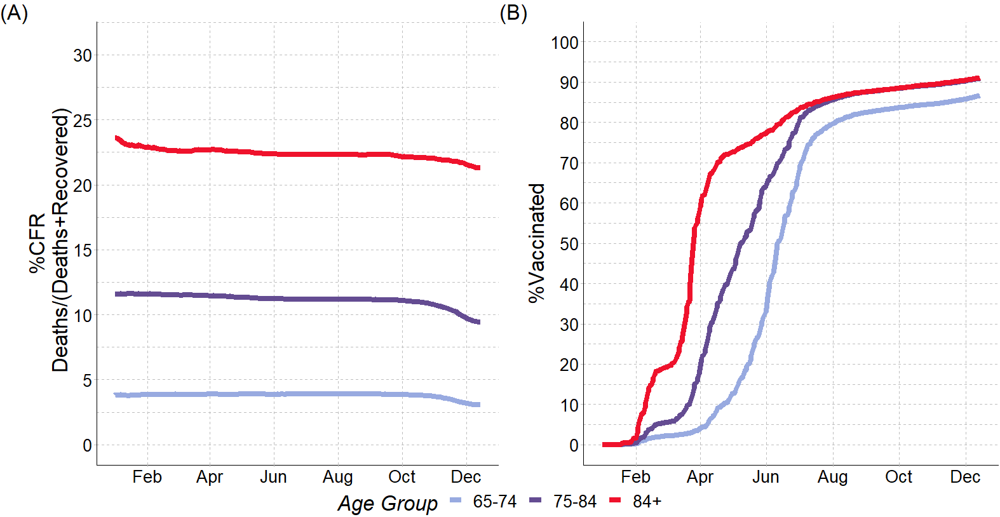
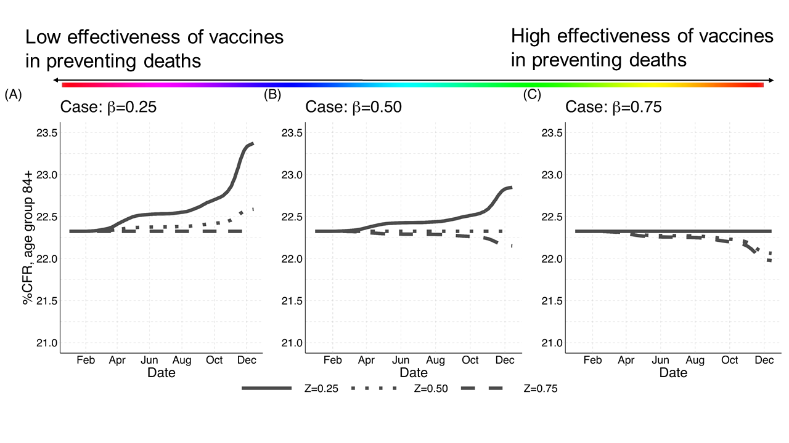

```{r setup, include=FALSE}
options(htmltools.preserve.raw = FALSE)
library(knitr)
```


class:remark-slide-content

## The CFR is particularly sensitive to <sup>1</sup>:

.pull-left-2[.content-box-blue[

 $$\text{CFR}_{t,a}=\frac{\text{Deaths}_{t,a}}{\text{Reported Cases}_{t,a}}$$


 
#### .red[Any] factor that impacts the number of .red[confirmed deaths] from a disease and the number of .red[reported cases] in a given time ###
 
]]

.pull-right-1[

- demographic factors


- delays in reported cases


- testing policies

]


.pull-left-2[.footnote[[1] (Dowd et al. 2020; Rajgor et al. 2020; Goldstein and Lee 2020; Green et al. 2020; Harman et al. 2021; Smith 2021; Luo et al. 2021; Undurraga et al. 2021)] ]

---

class: middle, center, remark-slide-content

## The BIG issue of the CFR is the denominator (?):

The CFR can be expressed as the sum of age-specific CFRs weighted by the proportion of cases in a certain age group  <sup>1</sup>

--

.pull-left-2[.content-box-blue[
$$\text{CFR} = \sum P_aC_a $$
]]

--

.pull-right-1[.content-box-red[
with $P_a=\frac{N_a}{N}$ and $C_a=\frac{D_a}{N_a}$]
]

--

.pull-left-2[.content-box-blue[
#### Hence, one can decompose/split the CFR into two parts:
$$CFR_i-CFR_j=\alpha+\delta $$
]]

--

.pull-right-1[.content-box-red[
with $\alpha$ being the age-structure of detected cases and $\delta$ the  age-structure of case-fatality rates]
]


---

class: remark-slide-content

## The BIG issue of the CFR is the denominator (?) <sup>1</sup>:

--

- the age-structure of detected cases $\alpha$ explained >60% of cross-country variation

--

- the age-structure of case-fatality rates $\delta$ within countries across time - mortality due to increasing age-specific case-fatality rates.]

.pull-left-1[.footnote[[1] (Dudel C, Riffe T, Acosta E, van Raalte A, Strozza C, Myrskyla, M (2020))]]

---

class: inverse, center, middle, remark-slide-content

## What happens in the presence of vaccines?

---

class: middle
      
Fig. 1 Case Fatality Rate (CFR) and %Fully Vaccinated Trajectories
      
  <div class="container">
   
          
  </div>
        
.remark-slide-content3[Source: Our World in Data (Mathieu et al. 2021)] 

---
class: 

Fig. 2 Panel (A) %Case-Fatality Rate (CFR); Panel (B) Share of fully vaccinated persons (%). Austria, by age, from Jan to Dec 2021

```{r fig2, echo=F, fig.align='center', warning=FALSE, out.width="95%"}

```
.remark-slide-content3[Source: The number of people vaccinated at each group is taken from BMSGPK, Österreichisches COVID-19 Open Data Informationsportal (2021)]

---

class: inverse, middle, center, remark-slide-content

# What drives the patterns in the CFR in the presence of vaccines?

---

class: inverse, center, middle, remark-slide-content

.pull-left-2[.content-box-blue[
$$\text{CFR}_{t,a}=\frac{\mathcal{D}^{U}_{t,a}+\color{red}{\mathcal{D}^{V}_{t,a}}}{d^{U}_{t,a}\mathcal{I}^{U}_{t,a}+\color{red}{d^{V}_{t,a}\mathcal{I}^{V}_{t,a}}}$$
]]

--

.pull-right-1[.content-box-red[
Let $m_{a}>0$ be the COVID fatality rate for the age group $a$ and $\beta_{a}\in(0,1)$ the effectiveness of vaccines in preventing deaths among the infected]]

--

Then, the fatality rate of the unvaccinated can be defined as $m_a$, while the fatality rate of the vaccinated becomes $m_a(1-\beta_a)$ (by definition smaller than $m_a$).

---

class: inverse, center, middle, remark-slide-content

Since the total number of deaths is given by the total number of infected times the associated fatality rate, we can rewrite $\text{CFR}_{t,a}$ as:

.content-box-blue[
$$\text{CFR}_{t,a}=\frac{\color{red}{m_{a}}\mathcal{I}^{U}_{t,a}+\color{red}{m_{a}}(1-\beta_{a})\mathcal{I}^{V}_{t,a}}{d^{U}_{t,a}\mathcal{I}^{U}_{t,a}+d^{V}_{t,a}\mathcal{I}^{V}_{t,a}}$$
]

--

.content-box-red[
Taking $\color{red}{m_a}$ as common factor and multiplying and dividing by $d^{U}_{t,a}$ gives:

$$\text{CFR}_{t,a}=\frac{m_{a}}{d^{U}_{t,a}}\frac{d^{U}_{t,a}\mathcal{I}^{U}_{t,a}+(1-\beta_{a})d^{U}_{t,a}\mathcal{I}^{V}_{t,a}}{d^{U}_{t,a}\mathcal{I}^{U}_{t,a}+d^{V}_{t,a}\mathcal{I}^{V}_{t,a}}$$
]


---

class: inverse, center, middle, remark-slide-content

If we call $\color{red}{\gamma_{t,a}}={d^{V}_{t,a}\mathcal{I}^{V}_{t,a}}/({d^{U}_{t,a}\mathcal{I}^{U}_{t,a}+d^{V}_{t,a}\mathcal{I}^{V}_{t,a}})$ the ratio between cases among the vaccinated and the total number of ever infected and detected cases, The case fatality rate can be rewritten as:

.content-box-blue[
$$\text{CFR}_{t,a}=\frac{m_{a}}{d^{U}_{t,a}}\left((1-\color{red}{\gamma_{t,a}})+(1-\beta_{a})\frac{d^{U}_{t,a}}{d^{V}_{t,a}}\color{red}{\gamma_{t,a}}\right)$$ 

]

--

The value of $\color{red}{\gamma_{t,a}}\in[0,1)$ will increase the higher is the number of cases among vaccinated individuals.

---

class: inverse, center, middle, remark-slide-content

Denoting $Z_{t,a}={d^V_{t,a}}/{d^{U}_{t,a}}$ as the proportion of detected cases among the ever infected after being vaccinated and the proportion detected among the ever infected and unvaccinated and substituting in the previous equation yields

.content-box-blue[

$$\text{CFR}_{t,a}=\frac{m_{a}}{d^{U}_{t,a}}\left((1-\gamma_{t,a})+\frac{1-\beta_{a}}{Z_{t,a}}\gamma_{t,a}\right)$$
]

or, alternatively:

--

.content-box-red[

$$\text{CFR}_{t,a}=\text{CFR}^{U}_{t,a}(1-\gamma_{t,a})+\underbrace{\text{CFR}^{U}_{t,a}\frac{1-\beta_{a}}{Z_{t,a}}}_\color{red}{\text{CFR}^{V}_{t,a}}\gamma_{t,a}$$ 
]

---

class: inverse, center, middle, remark-slide-content

.content-box-red[

$$\text{CFR}_{t,a}=\text{CFR}^{U}_{t,a}(1-\gamma_{t,a})+\underbrace{\text{CFR}^{U}_{t,a}\frac{1-\beta_{a}}{Z_{t,a}}}_\color{red}{\text{CFR}^{V}_{t,a}}\gamma_{t,a}$$ 
]


####This equation shows that the observed $\text{CFR}_{t,a}$ is the weighted sum of the CFR of the unvaccinated $\text{CFR}^{U}_{t,a}={m_{a}}/{d^{U}_{t,a}}$ and the CFR of the vaccinated $\text{CFR}^{V}_{t,a}=({m_{a}}/{d^{U}_{t,a}})((1-{\beta_{a}})/{Z_{t,a}})={m_{a}(1-\beta_a})/{d^{V}_{t,a}}$ 

---

class: inverse, center, middle, remark-slide-content

.content-box-blue[
$$\text{CFR}_{t,a}=\frac{\mathcal{D}^{U}_{t,a}+\mathcal{D}^{V}_{t,a}}{d^{U}_{t,a}\mathcal{I}^{U}_{t,a}+\color{red}{d^{V}_{t,a}\mathcal{I}^{V}_{t,a}}}=\text{CFR}^{U}_{t,a}(1-\color{red}{\gamma_{t,a}})+\text{CFR}^{V}_{t,a}\color{red}{\gamma_{t,a}}$$
]


--

$\text{CFR}_{t,a}$ being the weighted sum of $\text{CFR}^{U}_{t,a}$ and $\text{CFR}^{V}_{t,a}$ with weights $\color{red}{\gamma_{t,a}}$: 


.pull-left-1[.content-box-red[
$$\gamma_{t,a}= \frac{\color{red}{d^{V}_{t,a}\mathcal{I}^{V}_{t,a}}}{{d^{U}_{t,a}\mathcal{I}^{U}_{t,a}+\color{red}{d^{V}_{t,a}\mathcal{I}^{V}_{t,a}}}}$$]]

--

.pull-right-2[ 
the ratio between the total number of COVID vaccine .red[breakthroughs] and the total number of COVID-associated ever infected and detected cases] 


---

class: inverse, center, middle, remark-slide-content

.content-box-blue[
$$\text{CFR}_{t,a}=\text{CFR}^{U}_{t,a}(1-\color{red}{\gamma_{t,a}})+\text{CFR}^{V}_{t,a}\color{red}{\gamma_{t,a}}$$]

--

.pull-left-1[.content-box-red[
$$\gamma_{t,a}= 0$$ ]]


.pull-right-1[
No .red[breakthrough] cases: $\text{CFR}_{t,a} = \text{CFR}^{U}_{t,a}$]

--


.pull-left-1[.content-box-red[
$$\gamma_{t,a}\neq 0$$ ]]


.pull-right-1[
How does  $\text{CFR}^{V}_{t,a}\gamma_{t,a}$ affect the $\text{CFR}_{t,a}$?]

---


.pull-left-2[.content-box-blue[
$$\text{CFR}^{V}_{t,a}=\text{CFR}^{U}_{t,a}\frac{(1-\color{red}{\beta_{a}})}{\color{red}{Z_{t,a}}}$$]]

--

.pull-right-1[ $\beta_{a}$ = effectiveness of vaccines in preventing deaths

$Z_{t,a}$ = ratio of detection rates between the vaccinated and the unvaccinated

if $Z_{t,a}=1$, the rate of detection among vaccinated and unvaccinated is the same]

--

.pull-left-2[.content-box-red[
$$(1 − \beta_{a} ) = Z_{t,a}$$
the CFR will remain
**unchanged**, regardless the fact that the case fatality rate of the vaccinated is
**lower** than the case fatality rate of the unvaccinated. ]]

<!-- -- -->

<!-- .pull-left-2[.content-box-purple[the **lower** $\beta_{a}$, the **higher** $Z_{t,a}$ to keep CFR **constant**. the **higher** $\beta_{a}$, the **lower** $Z_{t,a}$ to keep CFR constant -->
<!--  ]] -->

.footnote[[2] Sánchez-Romero et al. 2021] 


---

.remark-slide-content2[Figure 3. Evolution of the %CFR for the age group 84+ in Austria (Jan-Dec 2021) by three different parameter values of]   $\beta_{(84+)}$ .remark-slide-content2[and] $Z_{(t,84+)}$

```{r fig3, echo=F, fig.align='center', warning=FALSE, out.width="85%"}

```
.remark-slide-content3[Source: Simulated CFR values are calculated using data from (Richter et al. 2020b, a)and BMSGPK, COVID-19 Open Data Informationsportal (2021),
di Lego, V., Sánchez-Romero, M., Prskawetz, A. (2022). The impact of COVID-19 vaccines on the Case Fatality Rate: The importance of monitoring breakthrough infections. *International Journal of Infectious Diseases*, 119, pp. 178–183]

---
class: middle

# Conclusions


- A constant CFR can **still** mean that vaccines are effective in reducing deaths


- Detecting infections among both the vaccinated and unvaccinated population is key 

- Unless vaccinated people are **also** tested, it is hard to use the CFR as an indicator for monitoring the pandemic

- However - CFR still useful measure for policy makers - how to improve/alternative measures

- Excess mortality also has its issues - maybe "temporary aging"?  


---
class: last, middle

## Thank you!

```{r fig5, fig.align = 'center', out.width = "90%", echo=F}

knitr::include_graphics(here::here("img", "simple_wrong.jpg"))

```


